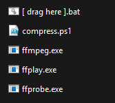
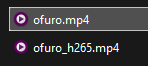
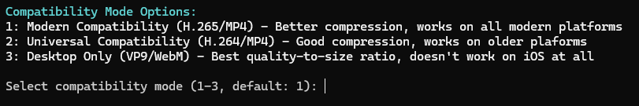
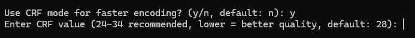

# ffmpeg_compressor_script
A simple powershell script that can help compress video files using ffmpeg

# Dependencies
Download the latest version of ffmpeg from https://ffmpeg.org/download.html
Download or copy the scripts from this repository to your computer.

# Installation
Place `ffmpeg.exe` and `ffmprobe.exe` in the same folder as the `[ drag here ].bat` and `compress.ps1` files from this repository.
Your folder should look something like this:



# Usage

1. Simply drag the video you want compressed onto the `[ drag here ].bat` file.
2. The script will ask a few questions and then compress the video, which will output a file with the same name but with its encoding appended to the end.
3. You can stop the script by pressing `q` or `Ctrl+C`.

# Advanced Usage
### Size (Default: 10 MB)
- Enter the target size in MB. By default, the script will compress the video to 10 MB, which is the maximum size that you can upload to Discord without Nitro on a non-boosted Server.
  - For example: You can set to 500 MB instead if you have Nitro and are compressing bigger videos.
- The compressor will use a margin of error to ensure the target size is met. For smaller files, the margin starts at 5%. For targets between 50-200 MB, the margin decreases to 3%. For targets above 200 MB, the margin decreases to 2%. Feel free to adjust these margins at lines 159-166 in the `compress.ps1` file if you'd like closer margins.
  - For example: When compressing a 29.41 MB video to 10 MB, the margin will target 9.5 MB instead. The end result was 9.8 MB, which is above the margin but below the target.

### Compatibility (Default: H.265/MP4)

- Choose a compression format to use. By default, the script will use H.265/MP4, which is compatible with modern platforms. This has been tested and works on iOS as well, which has been known to have compatibility issues with other formats (ffmpeg just needs to tag hvc1 for [Apple](https://developer.apple.com/documentation/http-live-streaming/hls-authoring-specification-for-apple-devices#2969487)).
- Choose H.264/MP4 if you need to support older platforms as this format is generally universaally compatible.
- Choose VP9/WebM if you want to use the VP9 codec. Note that this is not compatible with iOS by default and iOS users will need to download the video and view it using a third-party app such as VLC.

### Encoding (Default: 2-pass VBR)
- Choose between using CRF or 2-pass VBR encoding. By default, the script will use 2-pass VBR encoding as it can more reliably target file sizes while maintaining quality. Choose CRF if you want to target a specific quality and care less about the file size.

<h5> CRF (Constant Rate Factor) </h5>

- CRF is a method of encoding video that uses a single value to determine the quality of the video. The lower the value, the higher the quality. By default, the script will use a CRF of 28 for H.265 and 23 for H.264, which is a good balance between quality and file size. The lower the CRF, the higher the quality with the lowest being essentially lossless.


<h5> 2-pass VBR (2-pass Variable Bitrate) </h5>

- 2-pass VBR is a method of encoding video that uses two passes to determine the quality of the video. The first pass is used to determine the quality of the video, and the second pass is used to encode the video. By default, the script will use 2-pass VBR encoding as it can more reliably target file sizes while maintaining quality.

### ffmpeg Arguments
- By default, the script will use the following arguments for its 2-pass VBR encoding:

<b>libx265 (H.265):</b>
```
ffmpeg -i input.mp4 -c:v libx265 -preset medium -pix_fmt yuv420p -vf scale=-2:<height> -pass 1 -b:v <bitrate> -tag:v hvc1 -an -f null NUL
ffmpeg -i input.mp4 -c:v libx265 -preset medium -pix_fmt yuv420p -c:a copy -vf scale=-2:<height> -pass 2 -b:v <bitrate> -tag:v hvc1 output.mp4
```

| Argument | Details |
| :------- | :------ |
| -c:v libx265            | Uses the CPU, but results in better file size and quality. |
| -preset medium          | Uses a preset that balances quality and file size. H.265 is already slow, so we don't need to use veryslow. |
| -pix_fmt yuv420p        | Forces the color resolution half both ways and approximates 3 8-bit color channels. |
| -c:a copy               | Copies the audio stream from the input. Audio is already very small, so no need to re-encode it. There might be an aac lc inside the video already. |
| -vf scale=-2:\<height\> | Scales the video to the specified height, which is autommatically calculated via the script. |
| -tag:v hvc1             | Tags the video as hvc1, which is required for iOS. |

Note that these argument settings stemmed from this reddit [thread](https://www.reddit.com/r/ffmpeg/comments/133m7i0/compressing_videos_with_ffmpeg_for_discord/). I have made some adjustments in order to use H.265 instead of H.264, but the rest of the arguments are the same. Feel free to adjust these arguments if you want to experiment with different settings if you are more familiar with ffmpeg and what quality/file size you want.